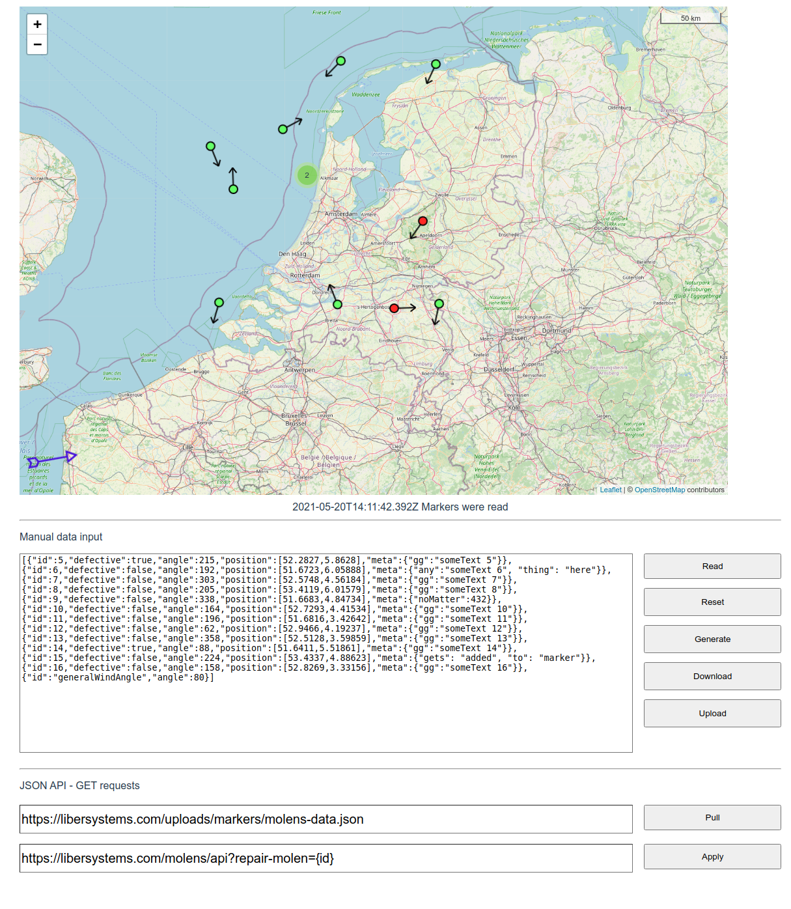

# Molens
## Wind mill geo position maintenance interface

- License: MIT License
- Author: Matteljay
- Language: Vue/JavaScript
- IDE: Android Studio
- Home page: https://libersystems.com

## About

Molens is a web application for visualizing the position and direction of wind mills. The ability to trigger specific actions per map marker is included. Several methods to import JavaScript Objects are facilitated. Molens also features a flexible triggering method which can connect to any http(s) capable back-end. It is a purely client-side webapp that is currently running live here: [molens.libersystems.com](http://molens.libersystems.com/). Additionally, Molens features the [Leaflet.JS library](https://leafletjs.com/) and can be adapted for many uses.

## Screenshots

## Usage

- **Read** button will render the data you typed or pasted into the text box, on the map as wind mills. This creates small directional popup items you can click on.
- **Reset** will clear the text box to the default text and re-render that minimal data set.
- **Generate** will generate a large data set of 2222 wind mills with random GPS coordinates in a square area overlapping The Netherlands.
- **Download** creates a file `markers.json` and saves it to your machine.
- **Upload** allows you to read any `.json` file from your local machine into the text box.

- **Pull** will instantly render any Molens-compatible online `.json` file from a specific URL.
- **Apply** changes the behavior of the *Repair* button on any defective wind mill. When you press that button, the specified URL will be used with matching wind mill `{id}` for triggering the *repair* communication signal to any web capable back-end.

Note that the required format of a single object in the JSON array is:

    { "id": Number/String, "defective": Boolean, "angle": Number(0 - 360), "position": Array(of 2 numbers), "meta": Anything }

An exceptional object is:

    { "id": "generalWindAngle", "angle": Number(0 - 360) }

This is optional and will determine the orientation of the purple arrow for general wind direction.

## Coding Details

- 500 lines of code in Vue.JS
- [Leaflet.JS](https://leafletjs.com/) mapping library using [OpenStreetMap](https://www.openstreetmap.org/)
- Vue-Leaflet extensions: [vue2-leaflet-rotatedmarker](https://github.com/mudin/vue2-leaflet-rotatedmarker), [vue2-leaflet-markercluster](https://github.com/jperelli/vue2-leaflet-markercluster)

## How to run

The files and folders in the [dist/](dist/) directory can be self-hosted on any web server. Alternatively as mentioned above, there is a live version running [here](http://molens.libersystems.com/).

## Contact info & donations

More info here: [CONTACT.md](CONTACT.md)
